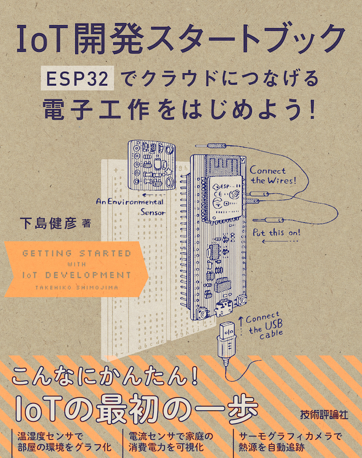

# 「IoT開発スタートブック」プログラム集

「[IoT開発スタートブック](https://amzn.to/2yINQDw)」で取り上げたプログラムです。

* [第2章 電子工作への第一歩](./2)
* [第3章 温度・湿度を可視化する](./3)
* [第4章 より実用的なセンサ端末を作る](./4)
* [第5章 MicroPythonで制御する](./5)
* [第6章 電力利用量を可視化する](./6)
* [第7章 サーモグラフィカメラで熱分布を可視化する](./7)
* [第8章 サーボモーターで熱源を追跡する](./8)
